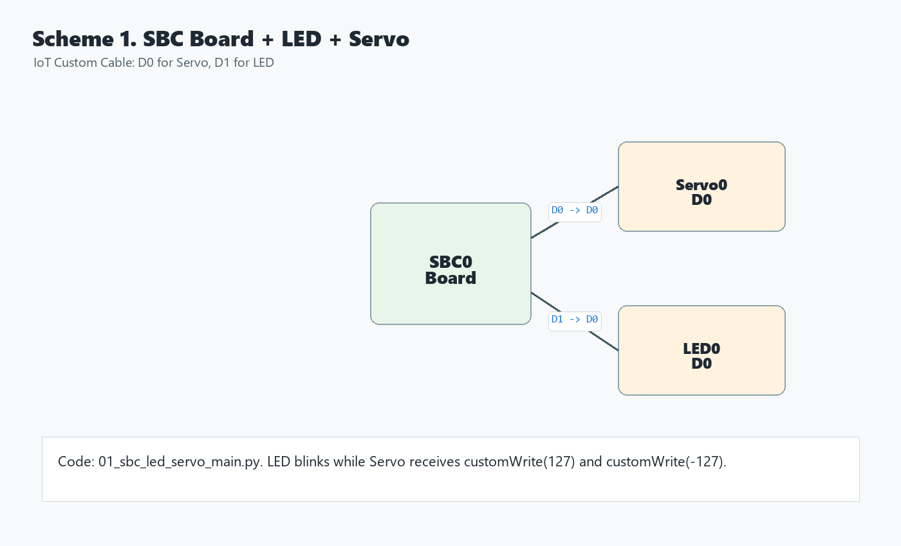
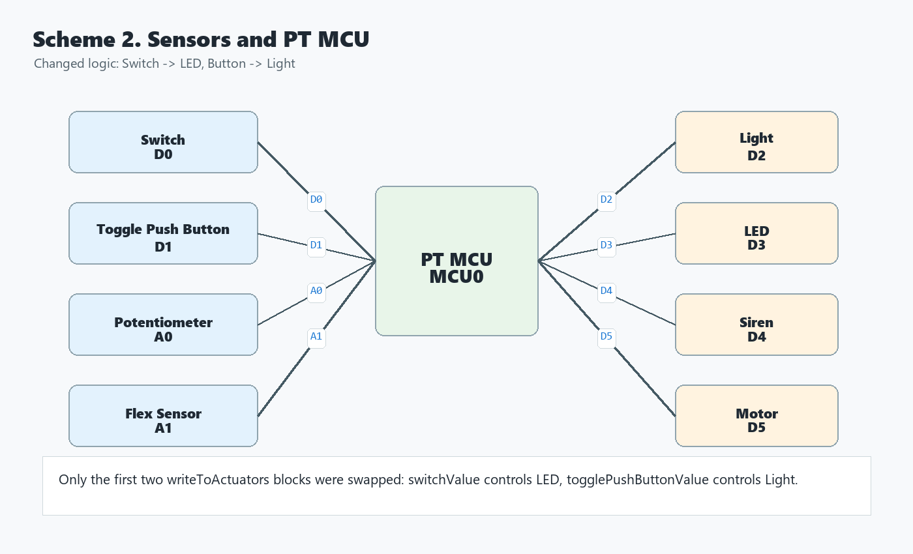
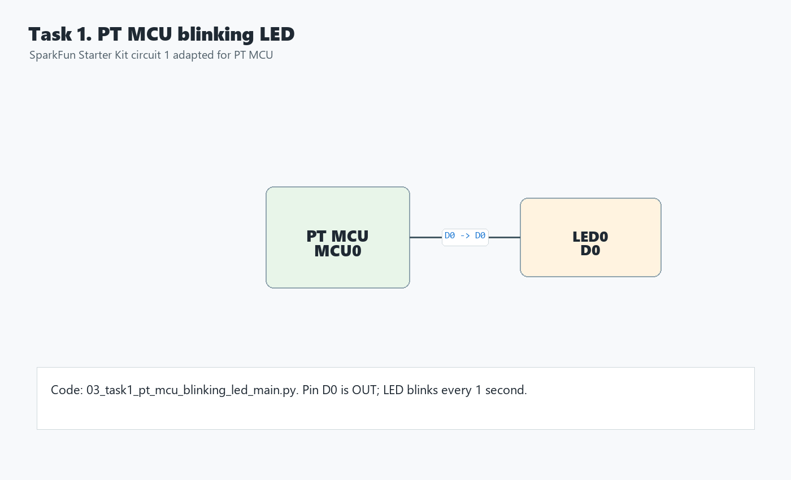
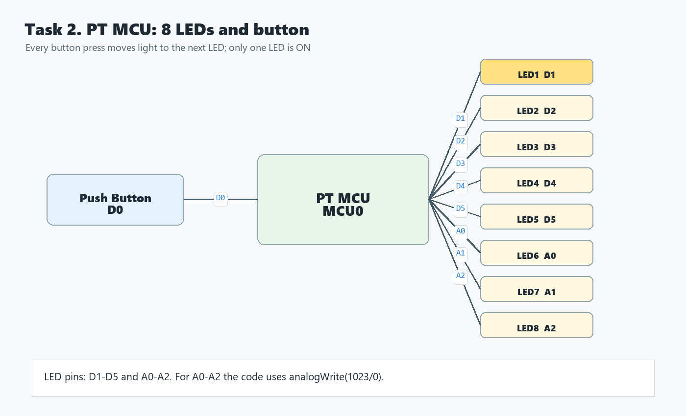

# Практична робота №1

**Тема:** Моделювання IoT в Cisco Packet Tracer  
**Студент:** Масоха Владислав Юрійович
**Мета:** навчитися моделювати IoT-пристрої у Cisco Packet Tracer, підключати датчики/виконавчі пристрої до SBC та PT MCU, змінювати програмну логіку керування.

## 1. Моделювання пристроїв IoT

### Топологія

У логічній робочій області Packet Tracer розміщено:

- `SBC Board`
- `Servo`
- `LED`

Підключення виконано кабелем `IoT Custom Cable`:

- `SBC0 D0 -> Servo0 D0`
- `SBC0 D1 -> LED0 D0`



### Код для SBC

Код для вставлення у вкладку Programming пристрою `SBC0`:

```python
from gpio import *
from time import *


LED_PIN = 1
SERVO_PIN = 0
DELAY_MS = 1000


def main():
    pinMode(LED_PIN, OUT)
    pinMode(SERVO_PIN, OUT)

    while True:
        digitalWrite(LED_PIN, HIGH)
        customWrite(SERVO_PIN, 127)
        delay(DELAY_MS)

        digitalWrite(LED_PIN, LOW)
        customWrite(SERVO_PIN, -127)
        delay(DELAY_MS)


if __name__ == "__main__":
    main()
```

### Результат

Після запуску програми світлодіод блимає, а сервопривод змінює напрямок руху синхронно зі станом світлодіода.

### Міркування

Щоб сервопривод повертався у зворотному напрямку під час блимання світлодіода, потрібно поміняти місцями значення `127` і `-127` у командах `customWrite(SERVO_PIN, ...)` або змінити знак відповідного значення.

## 2. Датчики та мікроконтролер PT

### Топологія

У центрі схеми розміщено `PT MCU`. Ліворуч підключені пристрої введення, праворуч - виконавчі пристрої:

- `Switch -> D0`
- `Toggle Push Button -> D1`
- `Potentiometer -> A0`
- `Flex Sensor -> A1`
- `Light -> D2`
- `LED -> D3`
- `Siren -> D4`
- `Motor -> D5`



### Змінена логіка

Початкова логіка була такою:

- перемикач керував світлом;
- кнопка керувала світлодіодом.

Після зміни коду:

- перемикач керує світлодіодом;
- кнопка керує світлом;
- потенціометр продовжує керувати сиреною;
- датчик згину продовжує керувати двигуном.

### Код для PT MCU

Код для вставлення у вкладку Programming пристрою `MCU0`:

```python
from gpio import *
from time import *


SWITCH_PIN = 0
BUTTON_PIN = 1
LIGHT_PIN = 2
LED_PIN = 3
SIREN_PIN = 4
MOTOR_PIN = 5
POTENTIOMETER_PIN = A0
FLEX_SENSOR_PIN = A1

switchValue = 0
togglePushButtonValue = 0
potentiometerValue = 0
flexSensorValue = 0


def readFromSensors():
    global switchValue
    global togglePushButtonValue
    global potentiometerValue
    global flexSensorValue

    switchValue = digitalRead(SWITCH_PIN)
    togglePushButtonValue = digitalRead(BUTTON_PIN)
    potentiometerValue = analogRead(POTENTIOMETER_PIN)
    flexSensorValue = analogRead(FLEX_SENSOR_PIN)


def writeToActuators():
    if switchValue == HIGH:
        digitalWrite(LED_PIN, HIGH)
    else:
        digitalWrite(LED_PIN, LOW)

    if togglePushButtonValue == HIGH:
        customWrite(LIGHT_PIN, "2")
    else:
        customWrite(LIGHT_PIN, "0")

    if potentiometerValue > 512:
        customWrite(SIREN_PIN, HIGH)
    else:
        customWrite(SIREN_PIN, LOW)

    if flexSensorValue > 0:
        analogWrite(MOTOR_PIN, flexSensorValue)
    else:
        analogWrite(MOTOR_PIN, 0)


def main():
    pinMode(SWITCH_PIN, IN)
    pinMode(BUTTON_PIN, IN)
    pinMode(LIGHT_PIN, OUT)
    pinMode(LED_PIN, OUT)
    pinMode(SIREN_PIN, OUT)
    pinMode(MOTOR_PIN, OUT)

    while True:
        readFromSensors()
        writeToActuators()
        delay(1000)


if __name__ == "__main__":
    main()
```

### Результат перевірки

- `ALT + click` на перемикачі змінює стан LED.
- `ALT + click` на кнопці змінює стан Light.
- Обертання потенціометра після порогового значення вмикає Siren.
- Згинання Flex Sensor змінює швидкість Motor.

## 3. Додаткове завдання 1: блимаючий світлодіод на PT MCU

### Топологія

- `PT MCU D0 -> LED0 D0`



### Код

Код для вставлення у вкладку Programming пристрою `MCU0`:

```python
from gpio import *
from time import *


LED_PIN = 0
DELAY_MS = 1000


def main():
    pinMode(LED_PIN, OUT)

    while True:
        digitalWrite(LED_PIN, HIGH)
        delay(DELAY_MS)
        digitalWrite(LED_PIN, LOW)
        delay(DELAY_MS)


if __name__ == "__main__":
    main()
```

### Результат

Світлодіод періодично вмикається та вимикається з інтервалом 1 секунда.

## 4. Додаткове завдання 2: 8 світлодіодів та кнопка

### Топологія

Використано `PT MCU`, одну кнопку та 8 світлодіодів, вишикуваних у ряд.

- `Push Button -> D0`;
- `LED1 -> D1`
- `LED2 -> D2`
- `LED3 -> D3`
- `LED4 -> D4`
- `LED5 -> D5`
- `LED6 -> A0`
- `LED7 -> A1`
- `LED8 -> A2`



### Код

Код для вставлення у вкладку Programming пристрою `MCU0`:

```python
from gpio import *
from time import *


BUTTON_PIN = 0
LED_PINS = [1, 2, 3, 4, 5, A0, A1, A2]
DEBOUNCE_MS = 200

currentLed = 0
lastButtonState = LOW


def writeLed(pin, state):
    if pin == A0 or pin == A1 or pin == A2:
        if state == HIGH:
            analogWrite(pin, 1023)
        else:
            analogWrite(pin, 0)
    else:
        digitalWrite(pin, state)


def setOnlyLed(index):
    for i in range(0, len(LED_PINS)):
        if i == index:
            writeLed(LED_PINS[i], HIGH)
        else:
            writeLed(LED_PINS[i], LOW)


def main():
    global currentLed
    global lastButtonState

    pinMode(BUTTON_PIN, IN)
    for pin in LED_PINS:
        pinMode(pin, OUT)

    setOnlyLed(currentLed)

    while True:
        buttonState = digitalRead(BUTTON_PIN)

        if buttonState == HIGH and lastButtonState == LOW:
            currentLed = (currentLed + 1) % len(LED_PINS)
            setOnlyLed(currentLed)
            delay(DEBOUNCE_MS)

        lastButtonState = buttonState
        delay(20)


if __name__ == "__main__":
    main()
```

### Результат

У початковому стані світиться перший світлодіод. Після кожного натискання кнопки поточний світлодіод вимикається, а наступний світлодіод у ряду вмикається. Після восьмого світлодіода послідовність повертається до першого. У будь-який момент світиться лише один світлодіод.

## Висновок

У практичній роботі створено та описано моделі IoT-пристроїв у Cisco Packet Tracer. Було налаштовано підключення SBC, PT MCU, датчиків і виконавчих пристроїв, змінено логіку керування в Python та підготовлено програми для додаткових схем з блимаючим світлодіодом і послідовним керуванням вісьмома світлодіодами.
